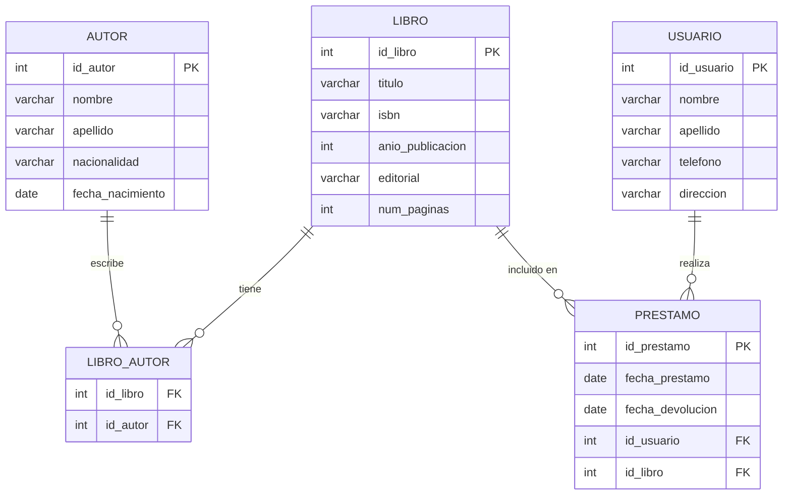
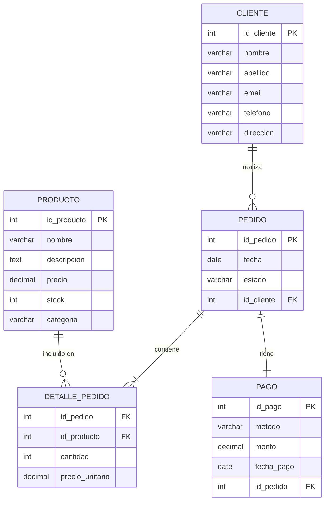
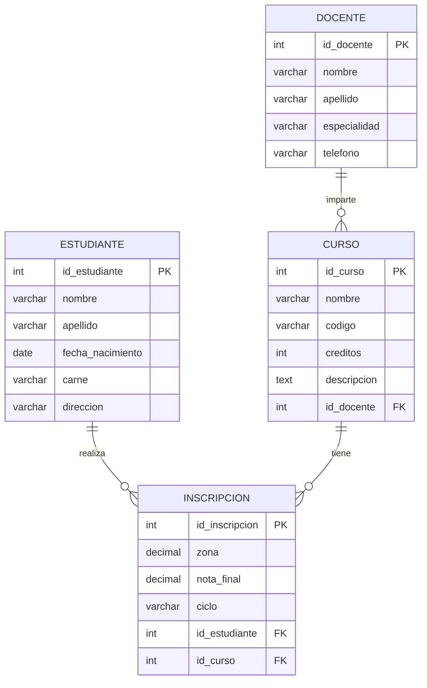
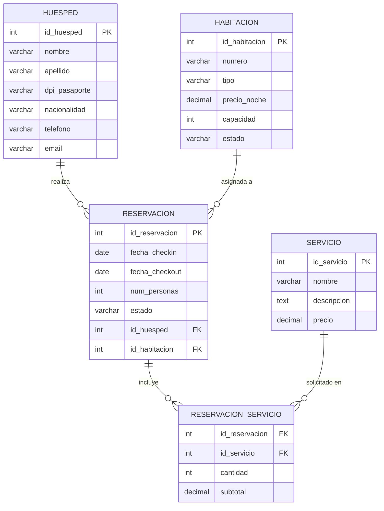

# Ejercicios de Diseño de Bases de Datos — Modelo Entidad-Relación

---

## Ejercicio 1: Sistema de Biblioteca (Nivel Básico)

**Descripción:** Diseña una base de datos para una biblioteca que gestione libros, autores y préstamos.

**Requisitos:**
- Los libros tienen título, ISBN, año de publicación, editorial y número de páginas
- Los autores tienen nombre, apellido, nacionalidad y fecha de nacimiento
- Un libro puede tener múltiples autores y un autor puede escribir múltiples libros
- Los usuarios tienen nombre, apellido, teléfono y dirección
- Se debe registrar qué usuario tiene prestado qué libro, con fechas de préstamo y devolución

**Tareas:**
1. Identifica las entidades principales
2. Define los atributos de cada entidad
3. Establece las relaciones entre entidades
4. Crea el modelo entidad-relación

---

### 1. Entidades principales

- Libro
- Autor
- Usuario
- Prestamo

---

### 2. Atributos de cada entidad

| Entidad  | Atributos                                              |
|----------|--------------------------------------------------------|
| Libro    | titulo, isbn, anio_publicacion, editorial, num_paginas |
| Autor    | nombre, apellido, nacionalidad, fecha_nacimiento       |
| Usuario  | nombre, apellido, telefono, direccion                  |
| Prestamo | fecha_prestamo, fecha_devolucion                       |

---

### 3. Relaciones entre entidades

| Relación               | Tipo  | Descripción                                               |
|------------------------|-------|-----------------------------------------------------------|
| Autor — Libro          | M a N | Un autor escribe múltiples libros y viceversa             |
| Usuario — Libro        | M a N | Un usuario puede tener prestados varios libros (Prestamo) |

> Las relaciones M:N requieren una tabla intermedia.  
> `Libro_Autor` resuelve la relación entre Libro y Autor.  
> `Prestamo` actúa como tabla intermedia entre Usuario y Libro, con atributos propios.

---

### 4. Modelo Entidad-Relación

---

---

## Ejercicio 2: Sistema de Tienda en Línea (Nivel Intermedio)

**Descripción:** Diseña una base de datos para una tienda en línea que gestione clientes, productos, pedidos y pagos.

**Requisitos:**
- Los productos tienen nombre, descripción, precio, stock disponible y categoría
- Los clientes tienen nombre, apellido, correo electrónico, teléfono y dirección de envío
- Un cliente puede realizar múltiples pedidos
- Un pedido puede contener múltiples productos con cantidad y precio unitario al momento de la compra
- Cada pedido tiene un estado (pendiente, enviado, entregado, cancelado) y una fecha
- Se registra el método de pago usado en cada pedido (tarjeta, transferencia, efectivo)

**Tareas:**
1. Identifica las entidades principales
2. Define los atributos de cada entidad
3. Define llaves primarias y foráneas
4. Establece las relaciones entre entidades
5. Crea el modelo entidad-relación

---

### 1. Entidades principales

- Cliente
- Producto
- Pedido
- Detalle_Pedido *(tabla intermedia entre Pedido y Producto)*
- Pago

---

### 2. Atributos de cada entidad

| Entidad        | Atributos                                                    |
|----------------|--------------------------------------------------------------|
| Cliente        | nombre, apellido, email, telefono, direccion                 |
| Producto       | nombre, descripcion, precio, stock, categoria                |
| Pedido         | fecha, estado                                                |
| Detalle_Pedido | cantidad, precio_unitario *(atributos propios de la relación)* |
| Pago           | metodo, monto, fecha_pago                                    |

---

### 3. Llaves primarias y foráneas

| Tabla          | PK             | FK(s)                       |
|----------------|----------------|-----------------------------|
| Cliente        | id_cliente     | —                           |
| Producto       | id_producto    | —                           |
| Pedido         | id_pedido      | id_cliente                  |
| Detalle_Pedido | —              | id_pedido, id_producto      |
| Pago           | id_pago        | id_pedido                   |

---

### 4. Relaciones entre entidades

| Relación                    | Tipo  | Descripción                                              |
|-----------------------------|-------|----------------------------------------------------------|
| Cliente — Pedido            | 1 a N | Un cliente puede hacer muchos pedidos                    |
| Pedido — Producto           | M a N | Un pedido tiene varios productos; Detalle_Pedido lo resuelve |
| Pedido — Pago               | 1 a 1 | Cada pedido tiene un único pago registrado               |

---

### 5. Modelo Entidad-Relación

---

---

## Ejercicio 3: Sistema de Colegio (Nivel Intermedio-Avanzado)

**Descripción:** Diseña una base de datos para un colegio que gestione estudiantes, cursos, docentes, inscripciones y notas.

**Requisitos:**
- Los estudiantes tienen nombre, apellido, fecha de nacimiento, carné y dirección
- Los docentes tienen nombre, apellido, especialidad y teléfono
- Los cursos tienen nombre, código, número de créditos y descripción
- Un docente puede impartir múltiples cursos, pero un curso es impartido por un solo docente
- Un estudiante puede inscribirse en múltiples cursos y un curso puede tener múltiples estudiantes
- Por cada inscripción se registran las notas parciales (zona) y la nota final del curso

**Tareas:**
1. Identifica las entidades principales
2. Define los atributos de cada entidad
3. Define llaves primarias y foráneas
4. Establece las relaciones entre entidades
5. Crea el modelo entidad-relación

---

### 1. Entidades principales

- Estudiante
- Docente
- Curso
- Inscripcion *(tabla intermedia entre Estudiante y Curso, con atributos de notas)*

---

### 2. Atributos de cada entidad

| Entidad     | Atributos                                              |
|-------------|--------------------------------------------------------|
| Estudiante  | nombre, apellido, fecha_nacimiento, carne, direccion   |
| Docente     | nombre, apellido, especialidad, telefono               |
| Curso       | nombre, codigo, creditos, descripcion                  |
| Inscripcion | zona, nota_final, ciclo *(ej. 2025-1)*                 |

---

### 3. Llaves primarias y foráneas

| Tabla       | PK              | FK(s)                           |
|-------------|-----------------|----------------------------------|
| Estudiante  | id_estudiante   | —                                |
| Docente     | id_docente      | —                                |
| Curso       | id_curso        | id_docente                       |
| Inscripcion | id_inscripcion  | id_estudiante, id_curso          |

---

### 4. Relaciones entre entidades

| Relación                  | Tipo  | Descripción                                                     |
|---------------------------|-------|-----------------------------------------------------------------|
| Docente — Curso           | 1 a N | Un docente imparte varios cursos; un curso tiene un solo docente |
| Estudiante — Curso        | M a N | Resuelta por la tabla Inscripcion                               |

---

### 5. Modelo Entidad-Relación

---

---

## Ejercicio 4: Sistema de Hotel (Nivel Avanzado)

**Descripción:** Diseña una base de datos para un hotel que gestione huéspedes, habitaciones, reservaciones y servicios adicionales.

**Requisitos:**
- Las habitaciones tienen número, tipo (simple, doble, suite), precio por noche, capacidad y estado (disponible, ocupada, mantenimiento)
- Los huéspedes tienen nombre, apellido, DPI/pasaporte, nacionalidad, teléfono y correo
- Una reservación registra las fechas de check-in y check-out, el número de personas y el estado (confirmada, activa, finalizada, cancelada)
- Un huésped puede tener múltiples reservaciones a lo largo del tiempo
- Una reservación corresponde a una sola habitación
- Durante la estadía, el huésped puede solicitar servicios adicionales (restaurante, lavandería, spa) que se cobran aparte

**Tareas:**
1. Identifica las entidades principales
2. Define los atributos de cada entidad
3. Define llaves primarias y foráneas
4. Establece las relaciones entre entidades
5. Crea el modelo entidad-relación

---

### 1. Entidades principales

- Huesped
- Habitacion
- Reservacion
- Servicio
- Reservacion_Servicio *(tabla intermedia — una reservación puede incluir múltiples servicios)*

---

### 2. Atributos de cada entidad

| Entidad               | Atributos                                                         |
|-----------------------|-------------------------------------------------------------------|
| Huesped               | nombre, apellido, dpi_pasaporte, nacionalidad, telefono, email    |
| Habitacion            | numero, tipo, precio_noche, capacidad, estado                     |
| Reservacion           | fecha_checkin, fecha_checkout, num_personas, estado               |
| Servicio              | nombre, descripcion, precio                                       |
| Reservacion_Servicio  | cantidad, subtotal *(atributos propios de la relación)*           |

---

### 3. Llaves primarias y foráneas

| Tabla                | PK               | FK(s)                               |
|----------------------|------------------|--------------------------------------|
| Huesped              | id_huesped       | —                                    |
| Habitacion           | id_habitacion    | —                                    |
| Reservacion          | id_reservacion   | id_huesped, id_habitacion            |
| Servicio             | id_servicio      | —                                    |
| Reservacion_Servicio | —                | id_reservacion, id_servicio          |

---

### 4. Relaciones entre entidades

| Relación                        | Tipo  | Descripción                                                       |
|---------------------------------|-------|-------------------------------------------------------------------|
| Huesped — Reservacion           | 1 a N | Un huésped puede tener varias reservaciones                       |
| Habitacion — Reservacion        | 1 a N | Una habitación puede tener reservaciones en diferentes fechas     |
| Reservacion — Servicio          | M a N | Una reservación puede incluir varios servicios adicionales        |

---

### 5. Modelo Entidad-Relación

